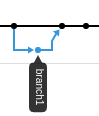
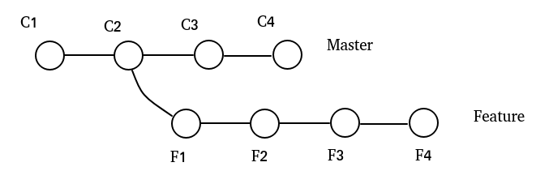
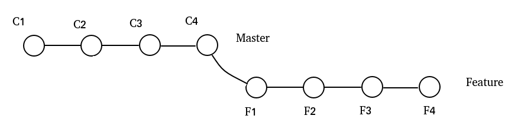
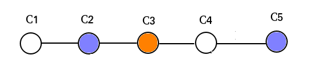
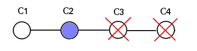

# git
This is just a repo where I create bugs, conflicts on purpose to learn git commands.

### --no-ff
When the base of the checked-out branch is the latest master and you merge the branch to master, git will do something called fast-forword to move the head pointer of master to current head of checked-out branch. It's not an actual commit.
So in order to merge 2 branches and preserve the status of the checked-out branch on the graph, you can do:
```
git merge --no-ff
```
or 
```
git pull --no-ff
```
The graph will look like



### git rebase 
Git will rewrite history by moving the entire new branch to the tip of the master branch. It actually create a new commit for each of the commits in the previous branch.
For example, before rebasing, the network graph look something like


Then do the rebasing by
```
git checkout feature
git rebase master
```

The graph will be like



`git rebase` can also allow you to modify previous n commits by interactive rebase with a number of provided options:
```
git rebase -i HEAD~n
```

After rebasing. Dont forget to do `git push -f `  or `git push --force` to apply your changes to remote repository, the `-f` or `--force` is important as git cannot fast forward  to push the changes and it has to be forced to do so. 
Click [here](https://www.atlassian.com/git/tutorials/merging-vs-rebasing) for more details.


Let's say sometimes you want to go back to several commits to restore your code if you miserably have deleted some important parts.
There are 2 ways to get them back

### git revert
The picture here depicts how `git revert` works:
 

Here you want to go back to the state at the commit C2. What you need to do is actualy back to the commit C3 and revert what you have changed there. So revert here is quite self-explanatory.
You will do 
```
git revert <ID of commit C3>
```
However, `git revert` will in fact create a new commit C5, and preserve all the commits in betwwen C2 and C5.
At the reverting part, conflicts might happen.

The second method is
### git reset
By doing `git reset --hard <commitID>`, git actually go back to the commit specified by its id and delete all the commits in front. 



